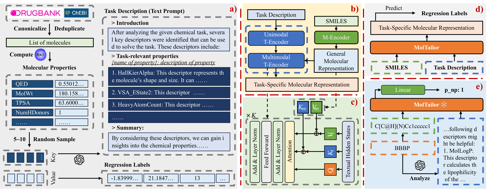

<div align="center">
    
</div>
<div align="center">
    <a href="https://arxiv.org/abs/2401.11403">
        
    </a>
    <a href="https://aaai.org/aaai-conference/">
        
    </a>
    <a href="https://pytorch.org/">
        
    </a>
        <a href="https://lightning.ai/docs/pytorch/stable/">
        
    </a>
    <a href="http://ir.hit.edu.cn/">
        
    </a>
</div>
<div align="center">
    <a href='readme_zh.md'>🇨🇳 <strong>中文</strong></a> | <a href='readme_en.md'>🌐 <strong>English</strong></a>
</div>

# MolTailor
> **NOTE**: In this project, MolTailor is referred to as ***DEN***.

Deep learning is now widely used in drug discovery, providing significant acceleration and cost reduction. As the most fundamental building block, molecular representation is essential for predicting molecular properties to enable various downstream applications. Most existing methods attempt to incorporate more information to learn better representations. However, not all features are equally important for a specific task. Ignoring this would potentially compromise the training efficiency and predictive accuracy. To address this issue, we propose a novel approach, which treats language models as an agent and molecular pretraining models as a knowledge base. The agent accentuates task-relevant features in the molecular representation by understanding the natural language description of the task, just as a tailor customizes clothes for clients. Thus, we call this approach **MolTailor**. Evaluations demonstrate MolTailor's superior performance over baselines, validating the efficacy of enhancing relevance for molecular representation learning. This illustrates the potential of language model guided optimization to better exploit and unleash the capabilities of existing powerful molecular representation methods.



## Table of Contents
- [1 File Structure](#1-file-structure)
- [2 Environment Setup](#2-environment-setup)
    - [2.1 Full Environment Setup](#21-full-environment-setup)
    - [2.2 Lightweight Environment Setup](#22-lightweight-environment-setup)
- [3 Data and Weights](#3-data-and-weights)
    - [3.1 Data](#31-data)
    - [3.2 Weights](#32-weights)
- [4 Pre-training](#4-pre-training)
    - [4.1 MT-MTR Corpus Construction](#41-mt-mtr-corpus-construction)
    - [4.2 Pre-training](#42-pre-training)
- [5 Downstream Tasks](#5-downstream-tasks)


## 1 File Structure
```shell
.
├── mt-mtr-build # Code for building the MT-MTR pre-training corpus
│   ├── 01-get-smiles.py # Merge SMILES from DrugBank and ChEBI
│   ├── 02-calculate-descriptors.py # Calculate molecular descriptors using RDKit
│   ├── 03-generate-descriptions.py # Generate task descriptions using GPT-3.5
│   ├── 04-build-mt-mtr.py # Build the MT-MTR corpus
│   └── data
│       ├── temporary # Store intermediate data
│       ├── mt-mtr.pt # MT-MTR
│       ├── mt-mtr-clean.pt # MT-MTR with molecules duplicated in 8 MoleculeNet datasets removed
│       ├── mt-mtr-origin.jsonl # MT-MTR with all molecular properties
│       └── mt-mtr-origin-clean.jsonl
├── pretrain # Pre-training code
│   ├── data # Store pre-training corpus mt-mtr.pt
│   ├── workspace # Checkpoint and log files
│   ├── models # Model structures
│   │   ├── bert_uncased # Backbone model code
│   │   ├── ...
│   │   ├── bert.py # Construct Multimodal T-Encoder based on BERT code
│   │   ├── config.py # MolTailor configuration file
│   │   ├── den.py # Specific implementation of MolTailor
│   │   ├── load.py # Load backbone
│   │   └── multitask.py # Pre-training task code
│   ├── data_collator.py
│   ├── data_modules.py
│   ├── dataset.py
│   ├── debug.py
│   ├── main.py # Entry file
│   ├── train.py
│   └── tune.py # Search for batch size and learning rate
├── linear-probe-moleculenet # Downstream task code
│   ├── models # Code for MolTailor and Baseline models
│   ├── data # MoleculeNet dataset and related preprocessing code
│   │   ├── feature # Extracted molecular embeddings
│   │   ├── raw # Original MoleculeNet dataset
│   │   ├── utils
│   │   │   ├── preprocess.py # MoleculeNet preprocessing code
│   │   │   └── feature-extract.py # Extract molecular embeddings
│   │   ├── prompt4molnet.json # Text prompts for MolTailor in downstream tasks
│   │   ├── bbbp.csv # Preprocessed MoleculeNet dataset
│   │   └── ...
│   ├── workspace # Checkpoint and log files
│   ├── callbacks.py # Callback functions for lightning
│   ├── data_modules.py
│   ├── dataset.py
│   ├── main.py # Entry file
│   ├── metrics.py # Implementation of roc_auc and delta ap methods
│   ├── multi_seeds.py
│   ├── split.py # Random and scaffold dataset splitting function implementations
│   ├── train.py
│   └── tune.py # Search for learning rate using optuna
├── linear-probe-moleculenet-lite # Downstream task code without Uni-Mol model, file structure is the same as above
│   └── ...
├── models # 模型权重
│   ├── BiomedNLP-PubMedBERT-base-uncased-abstract-fulltext # Default text backbone
│   ├── CHEM-BERT # Default molecular backbone
│   ├── ChemBERTa-10M-MTR
│   ├── DEN # MolTailor is named DEN in this project
│   │   ├── 0al3aezz # Using BioLinkBERT and ChemBERTa as backbones
│   │   ├── u02pzsl2 # Using PubMedBERT and ChemBERTa as backbones
│   │   ├── f9x97q2q # Using PubMedBERT and CHEM-BERT as backbones
│   │   └── ...
│   └── ...
├── readme
├── readme.md
├── requirements-lite.txt # Dependencies without Uni-Mol model
├── requirements.txt # Full dependencies
└── scripts
    ├── pretrain.sh # Pre-training script
    ├── convert_ckpt.sh # Move and convert the pre-trained model to the models folder
    ├── linear-probe-molnet.sh # Downstream task script
    └── linear-probe-molnet-lite.sh
```

## 2  Environment Setup
Due to the complex environment setup required for the Uni-Mol baseline model in downstream tasks, we offer two environment configuration options: a full version and a lightweight version. The full version has strict CUDA version requirements due to dependencies on the Uni-Mol model. If your environment doesn't meet these requirements, you may opt for the lightweight configuration.

## 2.1 Full Environment Setup
```bash
conda create -n moltailor python=3.9
conda activate moltailor
# It is recommended to use the specified versions of PyTorch and CUDA here to meet the dependencies of the uni-mol model later on.
conda install pytorch==2.0.0 torchvision==0.15.0 torchaudio==2.0.0 pytorch-cuda=11.8 -c pytorch -c nvidia 

cd MolTailor/
pip install -r requirements.txt
pip install dgl -f https://data.dgl.ai/wheels/cu118/repo.html 
pip install torch-scatter -f https://data.pyg.org/whl/torch-2.0.0+cu118.html

# Download Uni-Core wheel. You can download the version suitable for your system from the original project: https://github.com/dptech-corp/Uni-Core/releases/tag/0.0.3
wget https://github.com/dptech-corp/Uni-Core/releases/download/0.0.3/unicore-0.0.1+cu118torch2.0.0-cp39-cp39-linux_x86_64.whl
pip install unicore-0.0.1+cu118torch2.0.0-cp39-cp39-linux_x86_64.whl
# Delete the wheel file after installation
rm unicore-0.0.1+cu118torch2.0.0-cp39-cp39-linux_x86_64.whl
```

## 2.2 Lightweight Environment Setup
```bash
conda create -n moltailor python=3.9
conda activate moltailor
# You can choose versions that suit your system
conda install pytorch==2.0.0 torchvision==0.15.0 torchaudio==2.0.0 pytorch-cuda=11.8 -c pytorch -c nvidia

cd MolTailor/
pip install -r requirements.txt
# You can download the version that suits your system from the official website: https://www.dgl.ai/pages/start.html
pip install dgl -f https://data.dgl.ai/wheels/cu118/repo.html
# You can download the version that suits your system from the official website: https://pypi.org/project/torch-scatter/
pip install torch-scatter -f https://data.pyg.org/whl/torch-2.0.0+cu118.html
```

## 3 Data and Weights
### 3.1 Data
You can download the dataset from [Google Drive](https://drive.google.com/drive/folders/1zrBLQ6Fy_yCGUmSIVZ_mhxFemNfR4Fi5?usp=drive_link) or [Baidu Netdisk](https://pan.baidu.com/s/1l9V47Ka3dOSry9W8xiRHcQ?pwd=ka5d). All data files in the project are stored in the compressed file `MolTailor-Data.zip` following their original directory structure. Simply download and unzip this file, then move the `data` folder to the corresponding directory.

If you are only interested in the `MT-MTR` dataset, you can download the `MT-MTR.zip` file. After unzipping, the meaning of each file can be found in the comments of the subsection [File Structure](#1-file-structure).


### 3.2 Weights
You can download the model weights from [Google Drive](https://drive.google.com/drive/folders/1zrBLQ6Fy_yCGUmSIVZ_mhxFemNfR4Fi5?usp=drive_link) or [Baidu Netdisk](https://pan.baidu.com/s/1l9V47Ka3dOSry9W8xiRHcQ?pwd=ka5d). The `MolTailor-Models` folder contains weights for MolTailor and models that cannot be directly downloaded from Huggingface. Download the necessary model zip files, unzip them, and then move the folders to the `MolTailor/models/` directory.

For pre-training, the training process requires loading text and molecular modality backbones, which by default are `PubMedBERT` and `CHEM-BERT`. Therefore, you need to use the following commands to download the corresponding weight files.

For downstream tasks, you need to download the weight files corresponding to the model you want to test and move them to the `MolTailor/models/` folder after unzipping. It is important to note that the weight file for the MolTailor model is `DEN.zip`. Specifically, we provide three versions of MolTailor, which are:
- 0al3aezz: Uses BioLinkBERT and ChemBERTa as backbones
- u02pzsl2: Uses PubMedBERT and ChemBERTa as backbones
- f9x97q2q: Uses PubMedBERT and CHEM-BERT as backbones

The following models can be downloaded from Huggingface and are not included in the `MolTailor-Models` folder:

```shell
git lfs install
cd MolTailor/models

# BERT
git clone https://huggingface.co/google-bert/bert-base-uncased
# RoBERTa
git clone https://huggingface.co/FacebookAI/roberta-base
# SciBERT
git clone https://huggingface.co/allenai/scibert_scivocab_uncased
# BioLinkBERT
git clone https://huggingface.co/michiyasunaga/BioLinkBERT-base
# PubMedBERT
git clone https://huggingface.co/microsoft/BiomedNLP-BiomedBERT-base-uncased-abstract-fulltext

# ChemBERTa-10M-MTR
git clone https://huggingface.co/DeepChem/ChemBERTa-10M-MTR
# ChemBERTa-77M-MLM
git clone https://huggingface.co/DeepChem/ChemBERTa-77M-MLM
# ChemBERTa-77M-MTR 
git clone https://huggingface.co/DeepChem/ChemBERTa-77M-MTR

# T5
git clone https://huggingface.co/google-t5/t5-base
# MolT5
git clone https://huggingface.co/laituan245/molt5-base
# TCT5
git clone https://huggingface.co/GT4SD/multitask-text-and-chemistry-t5-base-augm
```

## 4 Pre-training
Please first refer to the instructions in the section [Data and Weights](#3-data-and-weights) to download the necessary data and weight files.

### 4.1 MT-MTR Corpus Construction
If you are interested in the process of constructing the MT-MTR corpus or wish to build your own MT-MTR corpus, you can refer to the code in the `mt-mtr-build` folder.

### 4.2 Pre-training
You can execute the following commands to start pre-training:

```shell
cd scripts
zsh pretrain.sh
```

It's important to note that our hyperparameters for pre-training were set based on our hardware resources (two `A100-80G` GPUs). You may need to adjust the hyperparameters based on your own resources.

Also, our provided pre-training code only supports BERT-like models such as `PubMedBERT` and `BioLinkBERT` as the text backbone, and `CHEM-BERT` as the molecular backbone. 

The pre-training code for using `ChemBERTa` as the molecular backbone is not provided, but the corresponding model weights are available for testing in downstream tasks. If you are interested in pre-training with `ChemBERTa` as the molecular backbone, you can raise an issue, and we will provide the corresponding code in the future.

After pre-training, you can execute the following script to move the model weights to the `MolTailor/models/` folder for subsequent downstream tasks:
```shell
cd scripts
zsh convert_ckpt.sh
```
Please ensure that there is a `DEN` folder under `MolTailor/models/` before proceeding.

## 5 Downstream Tasks
Please first refer to the instructions in the section [Data and Weights](#3-data-and-weights) to download the necessary data and weight files.

We have selected 8 tasks from MoleculeNet for downstream tasks, namely: BBBP, ClinTox, HIV, Tox21, ESOL, FreeSolv, Lipophilicity, and QM8. You can run the downstream task code by executing the following commands:
```bash
cd scripts
# If you have set up the full environment
zsh linear-probe-molnet.sh MODEL_NAME
# If you have set up the lightweight environment
zsh linear-probe-molnet-lite.sh MODEL_NAME
```
Supported model names include:
> Random、RDKit-FP、Morgan-FP、MACCS-FP、RDKit-DP、KCL、Grover、MolCLR、MoMu、CLAMP、Uni-Mol、Mole-BERT、CHEM-BERT、BERT、RoBERTa、SciBERT、PubMedBERT、BioLinkBERT、ChemBERTa-77M-MTR、ChemBERTa-10M-MTR、ChemBERTa-77M-MLM、MolT5、T5、TCT5、DEN-f9x97q2q、DEN-ChemBERTa-u02pzsl2、DEN-ChemBERTa-0al3aezz、

Among these, `DEN-f9x97q2q` represents MolTailor using PubMedBERT and CHEM-BERT as backbones, `DEN-ChemBERTa-u02pzsl2` represents MolTailor using PubMedBERT and ChemBERTa as backbones, and `DEN-ChemBERTa-0al3aezz` represents MolTailor using BioLinkBERT and ChemBERTa as backbones.

## Citation
```bibtex
@article{guo2024moltailor,
  title={MolTailor: Tailoring Chemical Molecular Representation to Specific Tasks via Text Prompts},
  author={Guo, Haoqiang and Zhao, Sendong and Wang, Haochun and Du, Yanrui and Qin, Bing},
  journal={arXiv preprint arXiv:2401.11403},
  year={2024}
}
```