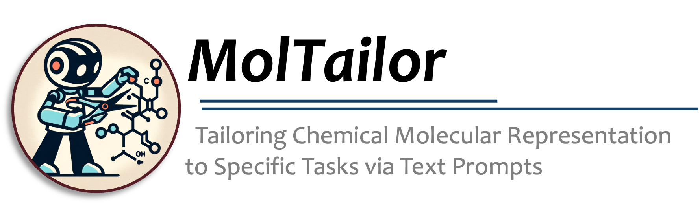
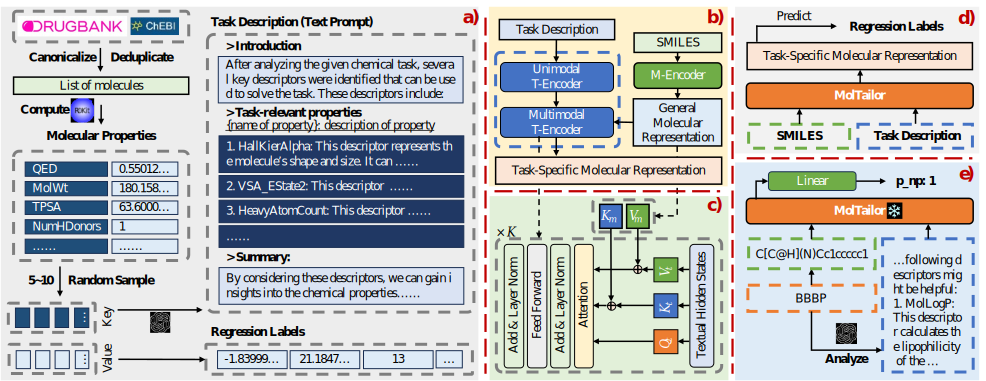

<div align="center">
    
</div>
<div align="center">
    <a href='readme_zh.md'>🇨🇳 <strong>中文</strong></a> | <a href='readme_en.md'>🌐 <strong>English</strong></a>
</div>
<div align="center">
    <a href="https://arxiv.org/abs/2401.11403" style="text-decoration: none;">
        
    </a>
    <a href="https://aaai.org/aaai-conference/" style="text-decoration: none;">
        
    </a>
    <a href="https://pytorch.org/" style="text-decoration: none;">
        
    </a>
        <a href="https://lightning.ai/docs/pytorch/stable/" style="text-decoration: none;">
        
    </a>
    <a href="http://ir.hit.edu.cn/" style="text-decoration: none;">
        
    </a>
</div>

# MolTailor


文章[MolTailor: Tailoring Chemical Molecular Representation to Specific Tasks via Text Prompts](https://arxiv.org/abs/2401.11403)的源码（发表在AAAI 2024）。


> **注意**：!!! 在本项目中MolTailor被命名为***DEN*** !!!




## 1 文件结构
```bash
.
├── mt-mtr-build # 用于构建MT-MTR预训练预料的代码
│   ├── 01-get-smiles.py # 合并来自drugbank与chebi的smiles
│   ├── 02-calculate-descriptors.py # 使用RDKit计算分子的描述符
│   ├── 03-generate-descriptions.py # 使用GPT-3.5生成任务描述
│   ├── 04-build-mt-mtr.py # 构建MT-MTR预料
│   └── data
│       ├── temporary # 存储中间数据
│       ├── mt-mtr.pt # MT-MTR
│       ├── mt-mtr-clean.pt # 去除与8个来自MoleculeNet数据集重复分子的MT-MTR
│       ├── mt-mtr-origin.jsonl # 包含全部分子属性的MT-MTR
│       └── mt-mtr-origin-clean.jsonl
├── pretrain # 预训练代码
│   ├── data # 存储预训练预料mt-mtr.pt
│   ├── workspace # checkpoint和log文件
│   ├── models # 模型结构
│   │   ├── bert_uncased # backbone模型代码
│   │   ├── ...
│   │   ├── bert.py # 基于bert代码，构建Multimodal T-Encoder
│   │   ├── config.py # MolTailor配置文件
│   │   ├── den.py # MolTailor的具体实现
│   │   ├── load.py # 加载backbone
│   │   └── multitask.py # 预训练任务代码
│   ├── data_collator.py
│   ├── data_modules.py
│   ├── dataset.py
│   ├── debug.py
│   ├── main.py # 入口文件
│   ├── train.py
│   └── tune.py # batch_size与学习率的搜索
├── linear-probe-moleculenet # 下游任务代码
│   ├── models # MolTailor及Baseline模型的代码实现
│   ├── data # MoleculeNet数据集及相关预处理代码
│   │   ├── feature # 模型提取的分子的Embedding特征
│   │   ├── raw # 原始的MoleculeNet数据集
│   │   ├── utils
│   │   │   ├── preprocess.py # MoleculeNet预处理代码
│   │   │   └── feature-extract.py # 提取分子的Embedding特征
│   │   ├── prompt4molnet.json # 用于下游任务的MolTailor的文本提示
│   │   ├── bbbp.csv # 预处理后的MoleculeNet数据集
│   │   └── ...
│   ├── workspace # checkpoint和log文件
│   ├── callbacks.py # lightning的回调函数
│   ├── data_modules.py
│   ├── dataset.py
│   ├── main.py # 入口文件
│   ├── metrics.py # roc_auc与delta ap的方法实现
│   ├── multi_seeds.py
│   ├── split.py # 数据集random与scaffold分割函数实现
│   ├── train.py
│   └── tune.py # 使用optuna搜索学习率
├── linear-probe-moleculenet-lite # 移除Uni-Mol模型的下游任务代码，文件结构与上面相同
│   └── ...
├── models # 模型权重
│   ├── bert-base-uncased
│   ├── CHEM-BERT
│   ├── ChemBERTa-10M-MTR
│   ├── DEN # MolTailor在本项目中用DEN命名，故权重存储在DEN文件夹下
│   └── ...
├── readme
├── readme.md
├── requirements-lite.txt # 移除Uni-Mol模型的依赖
├── requirements.txt # 完整依赖
└── scripts
    ├── pretrain.sh # 预训练脚本
    ├── convert_ckpt.sh # 将预训练后的模型移动到models文件夹，并进行转换
    ├── linear-probe-molnet.sh # 下游任务脚本
    └── linear-probe-molnet-lite.sh
```

## 2 环境配置
由于下游任务中，Baseline模型Uni-Mol的环境配置较为麻烦，因此我们提供了两种方式的环境配置方案：完整与轻量化配置。完整配置方案对cuda版本要求较为严格，受uni-mol模型的依赖影响，因此如果你的环境不满足完整配置的要求，可以选择轻量化配置方案。
## 2.1 完整环境
```bash
conda create -n moltailor python=3.9
conda activate moltailor
conda install pytorch==2.0.0 torchvision==0.15.0 torchaudio==2.0.0 pytorch-cuda=11.8 -c pytorch -c nvidia # 推荐这里使用的pytorch与cuda版本，以满足后续uni-mol模型的依赖

cd MolTailor/
pip install -r requirements.txt
pip install dgl -f https://data.dgl.ai/wheels/cu118/repo.html 
pip install torch-scatter -f https://data.pyg.org/whl/torch-2.0.0+cu118.html

wget https://github.com/dptech-corp/Uni-Core/releases/download/0.0.3/unicore-0.0.1+cu118torch2.0.0-cp39-cp39-linux_x86_64.whl # 你可以从原项目中下载适合自己的版本：https://github.com/dptech-corp/Uni-Core/releases/tag/0.0.3
pip install unicore-0.0.1+cu118torch2.0.0-cp39-cp39-linux_x86_64.whl
rm unicore-0.0.1+cu118torch2.0.0-cp39-cp39-linux_x86_64.whl # 安装完成后删除
```

## 2.2 轻量化环境
```bash
conda create -n moltailor python=3.9
conda activate moltailor
conda install pytorch==2.0.0 torchvision==0.15.0 torchaudio==2.0.0 pytorch-cuda=11.8 -c pytorch -c nvidia # 可选择适合自己的版本

cd MolTailor/
pip install -r requirements.txt
pip install dgl -f https://data.dgl.ai/wheels/cu118/repo.html # 你可以从官网下载合适自己的版本：https://www.dgl.ai/pages/start.html
pip install torch-scatter -f https://data.pyg.org/whl/torch-2.0.0+cu118.html # 你可以从官网下载适合自己的版本：https://pypi.org/project/torch-scatter/
```

## 3 预训练
### 3.1 MT-MTR预料构建
### 3.2 预训练

## 4 下游任务


## 引用