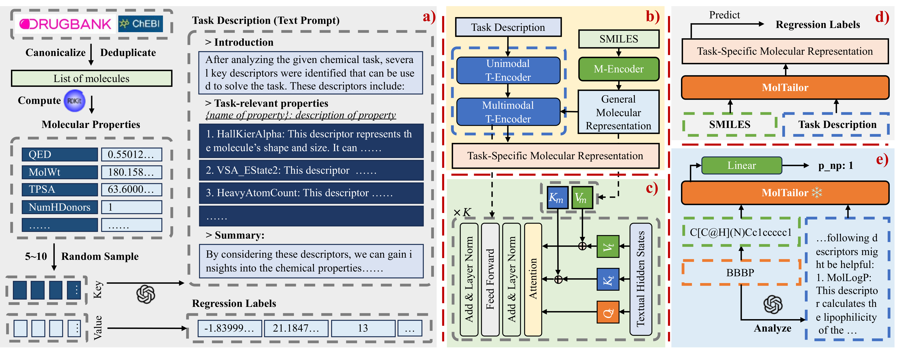

<div align="center">
    
</div>
<div align="center">
    <a href="https://arxiv.org/abs/2401.11403">
        
    </a>
    <a href="https://aaai.org/aaai-conference/">
        
    </a>
    <a href="https://pytorch.org/">
        
    </a>
        <a href="https://lightning.ai/docs/pytorch/stable/">
        
    </a>
    <a href="http://ir.hit.edu.cn/">
        
    </a>
</div>
<div align="center">
    <a href='readme_zh.md'>🇨🇳 <strong>中文</strong></a> | <a href='readme_en.md'>🌐 <strong>English</strong></a>
</div>

# MolTailor
> **注意**：!!! 在本项目中MolTailor被命名为***DEN*** !!!

如今深度学习技术已在药物发现领域得到广泛应用，加速了药物研发速度并降低了研发成本。分子表征学习是该应用的重要基石，对分子性质预测等下游应用具有重要意义。现有的大多数方法仅试图融入更多信息来学习更好的表征。然而，对于特定任务并非所有特征都是同等重要的。忽略这一点将潜在地损害分子表征在下游任务上的训练效率和预测准确性。为了解决这一问题，我们提出一种新颖的方法：该方法将语言模型视为智能体（Agent），将分子预训练模型视为知识库（KB）。语言模型通过理解任务描述，增强分子表征中任务相关特征的权重。因为该方法就像裁缝根据客户的要求定制衣服，所以我们将这种方法称为**MolTailor**。您可以[点击这里](https://mp.weixin.qq.com/s/ZqQb6hr5egKRJj2Fr0VRlA)阅读文章的中文版本。



## 目录
- [1 文件结构](#1-文件结构)
- [2 环境配置](#2-环境配置)
    - [2.1 完整环境](#21-完整环境)
    - [2.2 轻量化环境](#22-轻量化环境)
- [3 数据与权重](#3-数据与权重)
    - [3.1 数据](#31-数据)
    - [3.2 权重](#32-权重)
- [4 预训练](#4-预训练)
    - [4.1 MT-MTR预料构建](#41-mt-mtr预料构建)
    - [4.2 预训练](#42-预训练)
- [5 下游任务](#5-下游任务)


## 1 文件结构
```bash
.
├── mt-mtr-build # 用于构建MT-MTR预训练预料的代码
│   ├── 01-get-smiles.py # 合并来自drugbank与chebi的smiles
│   ├── 02-calculate-descriptors.py # 使用RDKit计算分子的描述符
│   ├── 03-generate-descriptions.py # 使用GPT-3.5生成任务描述
│   ├── 04-build-mt-mtr.py # 构建MT-MTR预料
│   └── data
│       ├── temporary # 存储中间数据
│       ├── mt-mtr.pt # MT-MTR
│       ├── mt-mtr-clean.pt # 去除与8个来自MoleculeNet数据集重复分子的MT-MTR
│       ├── mt-mtr-origin.jsonl # 包含全部分子属性的MT-MTR
│       └── mt-mtr-origin-clean.jsonl
├── pretrain # 预训练代码
│   ├── data # 存储预训练预料mt-mtr.pt
│   ├── workspace # checkpoint和log文件
│   ├── models # 模型结构
│   │   ├── bert_uncased # backbone模型代码
│   │   ├── ...
│   │   ├── bert.py # 基于bert代码，构建Multimodal T-Encoder
│   │   ├── config.py # MolTailor配置文件
│   │   ├── den.py # MolTailor的具体实现
│   │   ├── load.py # 加载backbone
│   │   └── multitask.py # 预训练任务代码
│   ├── data_collator.py
│   ├── data_modules.py
│   ├── dataset.py
│   ├── debug.py
│   ├── main.py # 入口文件
│   ├── train.py
│   └── tune.py # batch_size与学习率的搜索
├── linear-probe-moleculenet # 下游任务代码
│   ├── models # MolTailor及Baseline模型的代码实现
│   ├── data # MoleculeNet数据集及相关预处理代码
│   │   ├── feature # 模型提取的分子的Embedding特征
│   │   ├── raw # 原始的MoleculeNet数据集
│   │   ├── utils
│   │   │   ├── preprocess.py # MoleculeNet预处理代码
│   │   │   └── feature-extract.py # 提取分子的Embedding特征
│   │   ├── prompt4molnet.json # 用于下游任务的MolTailor的文本提示
│   │   ├── bbbp.csv # 预处理后的MoleculeNet数据集
│   │   └── ...
│   ├── workspace # checkpoint和log文件
│   ├── callbacks.py # lightning的回调函数
│   ├── data_modules.py
│   ├── dataset.py
│   ├── main.py # 入口文件
│   ├── metrics.py # roc_auc与delta ap的方法实现
│   ├── multi_seeds.py
│   ├── split.py # 数据集random与scaffold分割函数实现
│   ├── train.py
│   └── tune.py # 使用optuna搜索学习率
├── linear-probe-moleculenet-lite # 移除Uni-Mol模型的下游任务代码，文件结构与上面相同
│   └── ...
├── models # 模型权重
│   ├── BiomedNLP-PubMedBERT-base-uncased-abstract-fulltext # 默认的文本Backbone
│   ├── CHEM-BERT # 默认的分子Backbone
│   ├── ChemBERTa-10M-MTR
│   ├── DEN # MolTailor在本项目中用DEN命名
│   │   ├── 0al3aezz # 使用BioLinkBERT与ChemBERTa作为Backbone
│   │   ├── u02pzsl2 # 使用PubMedBERT与ChemBERTa作为Backbone
│   │   ├── f9x97q2q # 使用PubMedBERT与CHEM-BERT作为Backbone
│   │   └── ...
│   └── ...
├── readme
├── readme.md
├── requirements-lite.txt # 移除Uni-Mol模型的依赖
├── requirements.txt # 完整依赖
└── scripts
    ├── pretrain.sh # 预训练脚本
    ├── convert_ckpt.sh # 将预训练后的模型移动到models文件夹，并进行转换
    ├── linear-probe-molnet.sh # 下游任务脚本
    └── linear-probe-molnet-lite.sh
```

## 2 环境配置
由于下游任务中，Baseline模型Uni-Mol的环境配置较为麻烦，因此我们提供了两种环境配置方案：完整版与轻量化。完整版配置方案对cuda版本要求较为严格（受uni-mol模型的依赖影响），因此如果您的环境不满足配置要求，可以选择轻量化配置方案。
## 2.1 完整环境
```bash
conda create -n moltailor python=3.9
conda activate moltailor
# 请使用指定的pytorch与cuda版本，以满足后续uni-mol模型的依赖
conda install pytorch==2.0.0 torchvision==0.15.0 torchaudio==2.0.0 pytorch-cuda=11.8 -c pytorch -c nvidia 

cd MolTailor/
pip install -r requirements.txt
pip install dgl -f https://data.dgl.ai/wheels/cu118/repo.html 
pip install torch-scatter -f https://data.pyg.org/whl/torch-2.0.0+cu118.html
 # 你可以从原项目中下载适合自己的版本：https://github.com/dptech-corp/Uni-Core/releases/tag/0.0.3
wget https://github.com/dptech-corp/Uni-Core/releases/download/0.0.3/unicore-0.0.1+cu118torch2.0.0-cp39-cp39-linux_x86_64.whl
pip install unicore-0.0.1+cu118torch2.0.0-cp39-cp39-linux_x86_64.whl
# 安装完成后删除
rm unicore-0.0.1+cu118torch2.0.0-cp39-cp39-linux_x86_64.whl 
```

## 2.2 轻量化环境
```bash
conda create -n moltailor python=3.9
conda activate moltailor
# 可选择适合自己的版本
conda install pytorch==2.0.0 torchvision==0.15.0 torchaudio==2.0.0 pytorch-cuda=11.8 -c pytorch -c nvidia 

cd MolTailor/
pip install -r requirements.txt
# 你可以从官网下载合适自己的版本：https://www.dgl.ai/pages/start.html
pip install dgl -f https://data.dgl.ai/wheels/cu118/repo.html 
# 你可以从官网下载适合自己的版本：https://pypi.org/project/torch-scatter/
pip install torch-scatter -f https://data.pyg.org/whl/torch-2.0.0+cu118.html 
```

## 3 数据与权重
### 3.1 数据
您可以通过[百度网盘](https://pan.baidu.com/s/1l9V47Ka3dOSry9W8xiRHcQ?pwd=ka5d)或者[Google Drive](https://drive.google.com/drive/folders/1zrBLQ6Fy_yCGUmSIVZ_mhxFemNfR4Fi5?usp=drive_link)下载数据集。项目中所有的数据文件都按照原有的目录结构存储在压缩文件`MolTailor-Data.zip`中。您需要在下载、解压后，将`data`文件夹移动到对应的目录下。

如果您只对`MT-MTR`数据集感兴趣，可下载`MT-MTR.zip`文件，解压后各文件的含义可查看小节[文件结构](#1-文件结构)中的注释。

### 3.2 权重
您可以通过[百度网盘](https://pan.baidu.com/s/1l9V47Ka3dOSry9W8xiRHcQ?pwd=ka5d)或者[Google Drive](https://drive.google.com/drive/folders/1zrBLQ6Fy_yCGUmSIVZ_mhxFemNfR4Fi5?usp=drive_link)下载模型权重。`MolTailor-Models`文件夹下存储了MolTailor和不能直接从Huggingface下载的模型的权重。下载需要模型的zip文件，解压后将文件夹移动到`MolTailor/models/`文件夹下。

对于预训练，训练时需要加载文本与分子模态的Backbone，默认设置下为`PubMedBERT`与`CHEM-BERT`。为此，您需要使用下面的命令下载对应的权重文件。

对于下游任务，您需要下载想测试模型对应的权重文件，解压后移动到`MolTailor/models/`文件夹下。需要注意的是MolTailor模型对应的权重文件为`DEN.zip`。特别的，我们提供了三个版本的MolTailor，分别是：
- 0al3aezz: 使用BioLinkBERT与ChemBERTa作为Backbone
- u02pzsl2: 使用PubMedBERT与ChemBERTa作为Backbone
- f9x97q2q: 使用PubMedBERT与CHEM-BERT作为Backbone 


以下模型可以从Huggingface下载，不包含在`MolTailor-Models`文件夹中：
```shell
git lfs install
cd MolTailor/models

# BERT
git clone https://huggingface.co/google-bert/bert-base-uncased
# RoBERTa
git clone https://huggingface.co/FacebookAI/roberta-base
# SciBERT
git clone https://huggingface.co/allenai/scibert_scivocab_uncased
# BioLinkBERT
git clone https://huggingface.co/michiyasunaga/BioLinkBERT-base
# PubMedBERT
git clone https://huggingface.co/microsoft/BiomedNLP-BiomedBERT-base-uncased-abstract-fulltext

# ChemBERTa-10M-MTR
git clone https://huggingface.co/DeepChem/ChemBERTa-10M-MTR
# ChemBERTa-77M-MLM
git clone https://huggingface.co/DeepChem/ChemBERTa-77M-MLM
# ChemBERTa-77M-MTR 
git clone https://huggingface.co/DeepChem/ChemBERTa-77M-MTR

# T5
git clone https://huggingface.co/google-t5/t5-base
# MolT5
git clone https://huggingface.co/laituan245/molt5-base
# TCT5
git clone https://huggingface.co/GT4SD/multitask-text-and-chemistry-t5-base-augm
```

## 4 预训练
请您首先参考小节[数据与权重](#3-数据与权重)中的说明，下载需要的数据与权重文件。

### 4.1 MT-MTR预料构建
如果您对MT-MTR预料的构建过程感兴趣，或者期望构建自己的MT-MTR预料，可以参考`mt-mtr-build`文件夹中的代码。

### 4.2 预训练
您可以执行以下命令进行预训练：
```shell
cd scripts
zsh pretrain.sh
```
需要注意的是，我们预训练的超参数是根据我们的硬件资源设置的（两张`A100-80G`），您可能需要根据自身的资源对超参数进行调整。

同时，我们提供的pretrain代码只支持`PubMedBERT`、`BioLinkBERT`等BERT-like的模型作为文本backbone，`CHEM-BERT`作为分子backbone。

`ChemBERTa`作为分子backbone的预训练代码并未提供，但提供了对应的模型权重，你可以在下游任务中进行测试。如果您对使用`ChemBERTa`作为分子backbone进行预训练感兴趣，可以在Issuse中提出，我们会在后续提供对应的代码。

预训练后，你可以执行以下脚本将模型权重移动到`MolTailor/models/`文件夹下，以便后续下游任务使用：
```shell
cd scripts
zsh convert_ckpt.sh
```
需要注意的是，请确保`MolTailor/models/`文件夹下存在`DEN`文件夹。

## 5 下游任务
请您首先参考小节[数据与权重](#3-数据与权重)中的说明，下载需要数据与权重文件。
我们选取了MoleculeNet中的8个任务作为下游任务，分别是：BBBP、ClinTox、HIV、Tox21、ESOL、FreeSolv、Lipophilicity、QM8。你可以通过执行以下命令运行下游任务代码：
```bash
cd scripts
# 如果你配置了完整环境
zsh linear-probe-molnet.sh 模型名称
# 如果你配置了轻量化环境
zsh linear-probe-molnet-lite.sh 模型名称
```
支持的模型名称有：
> Random、RDKit-FP、Morgan-FP、MACCS-FP、RDKit-DP、KCL、Grover、MolCLR、MoMu、CLAMP、Uni-Mol、Mole-BERT、CHEM-BERT、BERT、RoBERTa、SciBERT、PubMedBERT、BioLinkBERT、ChemBERTa-77M-MTR、ChemBERTa-10M-MTR、ChemBERTa-77M-MLM、MolT5、T5、TCT5、DEN-f9x97q2q、DEN-ChemBERTa-u02pzsl2、DEN-ChemBERTa-0al3aezz、

其中，`DEN-f9x97q2q`表示使用PubMedBERT与CHEM-BERT作为Backbone的MolTailor，`DEN-ChemBERTa-u02pzsl2`表示使用PubMedBERT与ChemBERTa作为Backbone的MolTailor，`DEN-ChemBERTa-0al3aezz`表示使用BioLinkBERT与ChemBERTa作为Backbone的MolTailor。

## 引用
```bibtex
@article{guo2024moltailor,
  title={MolTailor: Tailoring Chemical Molecular Representation to Specific Tasks via Text Prompts},
  author={Guo, Haoqiang and Zhao, Sendong and Wang, Haochun and Du, Yanrui and Qin, Bing},
  journal={arXiv preprint arXiv:2401.11403},
  year={2024}
}
```